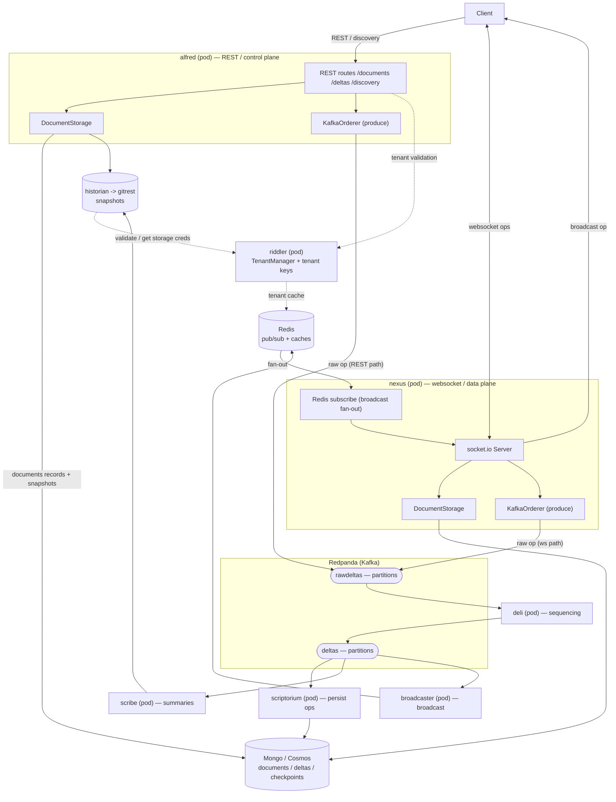
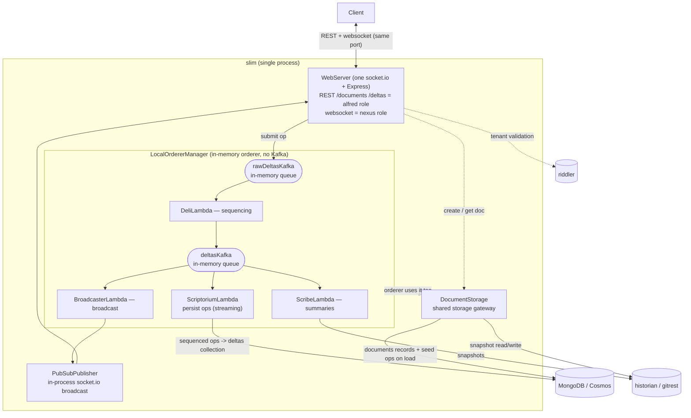

<!--
Copyright (c) Microsoft Corporation and contributors. All rights reserved.
Licensed under the MIT License.
-->

# Architecture — Routerlicious full-stack (Redpanda) and the slim alternative

This repo deploys **full-stack Routerlicious** — the production Fluid ordering
service — with the message broker provided by **Redpanda** (Kafka wire-protocol
compatible) instead of Kafka + ZooKeeper. A lighter **slim** single-process shape
of the *same* ordering logic is described at the end as a dev / prototype option.

Both topologies share the same storage gateway (`DocumentStorage`), the same
lambda pipeline (deli / scriptorium / scribe / broadcaster), and the same
external backends (MongoDB/Cosmos, historian/gitrest, riddler).

---

## 1. Full-stack (Redpanda) — the deployed shape

**Notes**

- `DocumentStorage` is a **library inside alfred and nexus** (each constructs its own), not a separate pod.
- Both alfred (REST path) and nexus (websocket path) can produce raw ops into the `rawdeltas` topic.
- Ordering pipeline over Kafka: `rawdeltas` -> deli (sequence) -> `deltas` -> scriptorium (Mongo) / scribe (historian) / broadcaster (Redis).
- Broadcast fan-out uses **Redis** pub/sub so ops reach clients across nexus instances; a document's ops are keyed by `documentId` to one partition -> one deli -> single sequencer per doc.
- **Redpanda** replaces Kafka + ZooKeeper with one process, speaks the Kafka wire protocol (the rdkafka orderer connects unchanged), and needs no ZooKeeper. `--mode=dev-container` auto-creates the delta topics.

---

## 2. slim (single process) — lightweight dev / prototype alternative

**Notes**

- One `socket.io` + Express `WebServer` serves both REST (alfred role) and the websocket delta stream (nexus role) on one port.
- `LocalOrdererManager` runs the full lambda pipeline **in-process**, wired by in-memory queues instead of Kafka — **no broker, no Redis**.
- Only three external dependencies: MongoDB/Cosmos, historian/gitrest, riddler.
- Trade-off: lightest and fastest to start, but no broker-grade failover or single-doc redundancy (on reconnect it reloads from a Mongo checkpoint), and it sits off the production microservice topology. Good for dev / prototype; the full-stack (Redpanda) shape above is the recommended production form.

---

## 3. Mapping: full-stack object <-> slim in-process equivalent

| full-stack (separate pod / internal object) | slim (same process) |
| --- | --- |
| alfred REST + nexus socket.io | one WebServer (Express + socket.io) |
| `DocumentStorage` inside alfred / nexus | same `DocumentStorage` (injected into LocalOrderer) |
| Redpanda topics `rawdeltas` / `deltas` | `LocalKafka` in-memory queues rawDeltasKafka / deltasKafka |
| deli / scriptorium / scribe / broadcaster (4 pods) | same 4 in-process lambdas |
| Redis pub/sub broadcast | in-process PubSubPublisher (socket.io) |
| MongoDB / historian / riddler | identical external dependencies |

**The difference is transport + process topology, not the components.** Full-stack
splits into pods connected by Redpanda + Redis; slim folds everything into one
process connected by in-memory queues + in-process pub/sub. The storage gateway
layer (`DocumentStorage`) is identical on both.
