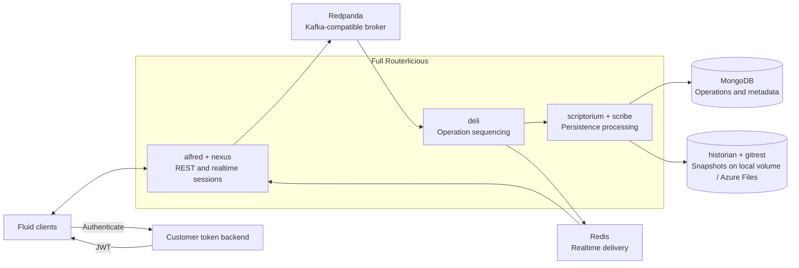

# Self-host Fluid Framework — Routerlicious + Redpanda

**Project owner:** Gin Fu

## Executive overview

This project turns the retirement of Azure Fluid Relay (AFR) into a concrete product and
engineering recommendation for the remaining third-party Fluid applications that need service
continuity. The work combined **product ownership with hands-on engineering**: defining the
customer problem and bounded scope, translating the AFR client experience into technical
requirements, evaluating architecture options, building and testing the leading candidates,
and converting the results into a deployable reference solution and receiving-team roadmap.

Four service shapes were evaluated across client behavior, durability, resource footprint,
operational complexity, and long-term maintainability. The project selected **full
Routerlicious + Redpanda** as the reference architecture: it retains the mainline Routerlicious
service topology and selected E2E result while replacing the Kafka broker and ZooKeeper
coordination service with one Kafka-compatible broker. In the recorded environment, Redpanda
used approximately **13× less average broker CPU, 33× less peak broker CPU, and 2.2× less
broker memory** than the stock baseline.

Delivered artifacts include source-built local and Azure AKS deployments, persistent operations
and snapshot storage, deployment automation and runbooks, and a real **Fluid Chat** validation
covering document creation, realtime two-client sync, cold-load, convergence, and audience
presence. The productionization handoff covers token issuance, AFR migration, upgrades, backup,
monitoring, and service ownership.

> This README follows the complete project path: **scope → requirements → architecture
> comparison → decision → implementation → local and Azure validation → customer deployment →
> migration → maintenance → production handoff**.

### Repository guide

| Need | Go to |
| --- | --- |
| Detailed service topology, data flow, and slim alternative | [ARCHITECTURE.md](./ARCHITECTURE.md) |
| Recorded tests, provenance, failures, and evidence boundaries | [VALIDATION.md](./VALIDATION.md) |
| Local deployment with ordered VERIFY gates | [AGENTS.md](./AGENTS.md) |
| Azure deployment commands, verification, and cleanup | [azure/README.md](./azure/README.md) |
| Final team decisions and production acceptance criteria | [HANDOFF.md](./HANDOFF.md) |
| Token prototype and production identity boundary | [token-function/README.md](./token-function/README.md) |

---

## 1. Final delivered solution

### 1.1 Architecture overview

The final reference architecture keeps the full Routerlicious service topology and replaces
the Kafka broker and ZooKeeper coordination service with Redpanda through Routerlicious's
existing Kafka-protocol integration.



Fluid clients authenticate through a customer token backend and connect to alfred and nexus.
Redpanda carries operations through the Routerlicious ordering path; MongoDB persists operations
and metadata; historian/gitrest persists snapshots; and Redis carries sequenced operations back
to connected clients. Detailed service boundaries, topic flow, and component responsibilities
are documented in [ARCHITECTURE.md](./ARCHITECTURE.md).

### 1.2 Complete lifecycle solution

| Lifecycle area | Final solution | Delivery state |
| --- | --- | --- |
| **Fluid service** | Full Routerlicious with Redpanda as the Kafka-compatible broker | Implemented and validated locally and on AKS |
| **Operations and metadata** | MongoDB-backed document records, operations, and checkpoints | Implemented with persistent storage |
| **Customer-owned durable storage** | `IFileSystemManager` provides the snapshot-storage contract. The validated Azure implementation uses Azure Files; Azure Blob is the default bring-your-own-storage example, and customers can connect another preferred backend through a compatible implementation | Azure Files implemented and exercised through cold-load; Blob and other custom adapters not delivered |
| **Token and identity** | Customer backend authenticates users, authorizes document access, and issues short-lived Routerlicious JWTs | Development token path validated; production token service required |
| **Local deployment** | Source-built Docker Compose with amd64 and arm64 entry points | Implemented with health and smoke verification |
| **Azure deployment** | ACR + AKS + Helm, managed-disk PVCs, Azure Files, and explicit service endpoints | Implemented and validated with Fluid Chat |
| **AFR migration** | Read-only freeze, latest-state recreation, validation, and controlled cutover | Core concept exercised; production tooling required |
| **Maintenance** | Pin, build, test, stage, deploy, monitor, and roll back; back up durable stores | Operating model and receiving-team responsibilities defined |

Customers control the durable state through the pluggable `IFileSystemManager` contract. The
validated zero-code Azure path uses Azure Files. Azure Blob is the default bring-your-own-storage
example; Blob or another preferred backend requires a compatible adapter and production validation
for correctness, concurrency, recovery, backup/restore, and lifecycle behavior.

### 1.3 Delivered artifacts

This repository contains the local Compose stacks, source-build automation, smoke tests, Azure
manifests, Routerlicious Helm values, architecture and validation records, and phase-by-phase
operator runbooks.

---

## 2. Scope and requirements

AFR is being retired while a limited set of third-party applications still depends on it.
This project is a **supporting continuity bridge** for that audience, not a new general-purpose
platform or a recreation of every managed-service capability.

Applications rely on Fluid for two connected outcomes: **real-time synchronization and durable
data**. The self-host path therefore had to account for the AFR capabilities visible to a Fluid
client and for the operational responsibilities that move to the receiving team:

- **Collaboration:** connect, create/load, operation ordering, realtime updates, signals,
  audience, and presence.
- **Persistence:** document metadata, sequenced operations, checkpoints, summaries/snapshots,
  and later cold-load.
- **Access:** tenant, document, user, scopes, signing-key custody, and authorization policy.
- **Compatibility and identity:** supported Fluid clients and document-reference mapping.
- **Deployment and operations:** customer/team-operated infrastructure, health, recovery,
  upgrades, security response, backup/restore, and incidents.
- **Migration:** a defined way to move durable state and manage the cutover seam.

---

## 3. Architecture comparison and decision

### 3.1 Options evaluated

- **Stock Routerlicious with Kafka + ZooKeeper:** the full reference topology, but with the
  heaviest broker and coordination footprint in the comparison.
- **Full Routerlicious with Redpanda:** the same full service shape using one Kafka-compatible
  broker and no custom ordering implementation.
- **Slim Routerlicious:** a single-process assembly using in-process queues; efficient for
  development and prototypes but a different operational and maintenance path.
- **Tinylicious:** the simplest development server and fastest startup path, but not selected
  as the customer/team-operated baseline.

### 3.2 Recorded comparison

The Fluid client E2E results recorded against all four shapes are summarized below.

| Shape | Containers | Recorded E2E | Broker / runtime observation | Fit |
| --- | :--: | --- | --- | --- |
| Kafka + ZooKeeper | 15 | 634 pass / 6 fail / 492 skip (328 s) | broker avg CPU 62%, peak 333%, ~634 MiB | Full baseline; heavy broker tier |
| **Full + Redpanda** | 14 | 634 pass / 6 fail / 492 skip (346 s) | broker avg CPU 4.9%, peak 10%, ~289 MiB | **Selected reference** |
| Slim | 8 | 634 pass / 6 fail / 492 skip (189 s) | slim process 61% CPU / 339 MiB | Development / prototype |
| Tinylicious | 1 | 658 pass (149 s) | one process, ~421 MiB average | Development only |

For the same recorded full-suite result, Redpanda used approximately **13× less average broker
CPU, 33× less peak broker CPU, 2.2× less broker memory, and one fewer container** than Kafka +
ZooKeeper. These are comparative engineering observations from the recorded development
environment, not production-capacity figures. Full provenance is in
[VALIDATION.md](./VALIDATION.md).

### 3.3 Decision

**Full Routerlicious + Redpanda** was selected because the continuity requirement was larger than
starting a Fluid-compatible server. The service needed an ordering path that could survive beyond
one application process without restoring Kafka and ZooKeeper's recorded cost.

The decision combined five findings:

1. **The broker isolates ordering from one process.** Full Routerlicious separates client gateways,
  sequencing, operation persistence, summaries, and broadcast through the `rawdeltas` and `deltas`
  streams. Redpanda preserves this architecture through Routerlicious's existing Kafka-protocol
  integration rather than introducing a new ordering implementation.
2. **Removing the broker changes the failure model.** Slim and Tinylicious replace those streams
  with in-memory queues and in-process pub/sub. If that process fails, the active ordering session
  has no broker log or second orderer to continue from; clients must reconnect and the service must
  reload persisted state. Slim restores through its Mongo-backed path; Tinylicious uses its
  configured LevelDB/local-storage path. Neither provides seamless broker-style failover or
  single-document redundancy.
3. **The broker preserves a scale-out path.** Full can partition documents across ordering workers
  and deploy gateways, sequencing, persistence, and broadcast independently. A brokerless replica
  model instead requires document-to-replica sticky routing so one process remains the sequencer for
  each document, leaving that document bounded by a single process and failure domain.
4. **Redpanda reduced broker-tier complexity while retaining the full topology.** The recorded
  comparison above shows the E2E and resource trade-off against Kafka + ZooKeeper.
5. **Full + Redpanda was the smaller structural change.** It keeps the existing Routerlicious service
  shape and swaps one Kafka-compatible component. Slim and Tinylicious proved that brokerless
  collaboration can work with the single-process ordering and recovery model above. They remain
  useful when minimum footprint matters more than broker-backed recovery and scale-out.

---

## 4. What was implemented and validated

### 4.1 Local reference deployment

The project delivered source-built amd64 and arm64 Compose paths containing full Routerlicious,
Redpanda, MongoDB, Redis, historian, gitrest, riddler, proxying, health checks, and persistent
MongoDB/snapshot volumes. PowerShell and bash entry points fetch or reuse FluidFramework source,
build the images, start the stack, wait for health, and run smoke verification.

Local evidence included service health, HTTP smoke checks, the Fluid client E2E suite, and the
four-shape resource comparison. This demonstrated that the Redpanda substitution retained the
selected suite result and that the complete exercised collaboration pipeline ran on the local
self-host stack.

### 4.2 Azure reference deployment

The same architecture was deployed to Azure using source-built images in ACR, full
Routerlicious on AKS, PVC-backed Redpanda, persistent MongoDB, in-cluster Redis, and
historian/gitrest snapshots on Azure Files. The final manifests explicitly configure the broker
PVC, while the Azure runbook explicitly bootstraps the broker topics. The Helm values and service
exposure provide the alfred, nexus, and historian client paths.

### 4.3 Fluid Chat validation

A real Fluid Chat application running locally connected to the Azure-hosted deployment and
completed the exercised client lifecycle:

1. connected to alfred, nexus, and historian;
2. created and attached a Fluid document;
3. opened the existing document in a second client;
4. exchanged realtime operations between clients;
5. cold-loaded persisted state and converged to the same value; and
6. reported both clients in the audience.

The Redpanda restart check also retained both topics and their eight-partition / replication-
factor-1 configuration. Together, the recorded results demonstrate that full Routerlicious can
run as a self-host service, Redpanda can satisfy the exercised Kafka-protocol path, real clients
can collaborate through the AKS deployment, and persisted state can initialize a second client.
The complete evidence matrix is in [VALIDATION.md](./VALIDATION.md).

---

## 5. Customer self-host adoption guide

This section describes how a third-party team moves an existing Fluid application from a managed
relay dependency to a service it operates. The scripts and Azure runbook deploy the infrastructure;
the customer adoption path also includes identity, application configuration, data migration,
validation with the customer's own application, and ongoing ownership.

### 5.1 Evaluate the reference locally

**Prerequisites:** Docker, git, a running Docker daemon, and free host ports. From the repository
root, run the script matching the host architecture:

```powershell
./scripts/run-local.ps1          # amd64 PowerShell
./scripts/run-local-arm64.ps1    # arm64 PowerShell
```

```bash
./scripts/run-local.sh           # amd64 bash
./scripts/run-local-arm64.sh     # arm64 bash
```

The script builds from FluidFramework source, starts the stack, waits for health, and finishes
with `SMOKE PASS`. Set `FLUID_REPO_DIR` to reuse an existing checkout. The primary client
endpoint is `http://127.0.0.1:3003`, historian is on port `3001`, and the default development
tenant is `fluid`.

To repeat the selected client E2E suite from a built FluidFramework checkout:

```bash
cd packages/test/test-end-to-end-tests
pnpm run test:realsvc:r11s:docker -- --compatKind=None
```

Stop while retaining local MongoDB and snapshot volumes with
`docker compose -f <compose-file> down`; add `-v` to delete those volumes. Use
`docker-compose.redpanda.yml` on amd64 and `docker-compose.redpanda.arm64.yml` on arm64. See
[AGENTS.md](./AGENTS.md) for all VERIFY gates and troubleshooting.

### 5.2 Adopt the service for a third-party application

Follow this customer journey in order:

1. **Confirm the application contract** — record the Fluid SDK versions in use, required client
  capabilities, tenant/document model, expected session shape, region, and data-residency needs.
2. **Assign operational ownership** — name the team responsible for the Azure subscription,
  service availability, security updates, incidents, storage lifecycle, backup, and restore.
3. **Choose durable storage** — use the validated Azure Files snapshot path or connect the
  customer's preferred backend through a compatible `IFileSystemManager` implementation. Azure
  Blob is the default bring-your-own-storage example. Select the supported MongoDB topology for
  document metadata, operations, and checkpoints.
4. **Build the customer release** — pin a reviewed FluidFramework revision and complete patch
  set, build immutable routerlicious/historian/gitrest images, and publish them to the customer's
  ACR.
5. **Deploy the Azure service** — create AKS, deploy Redpanda and its topics, deploy the storage
  backends, install Routerlicious, and expose alfred, nexus, and historian behind the customer's
  DNS and TLS boundary.
6. **Integrate customer identity** — connect the existing identity provider to a trusted backend
  that authorizes tenant/document access and issues short-lived Routerlicious JWTs without
  exposing the tenant signing key.
7. **Configure the existing Fluid application** — replace the AFR connection configuration with
  the customer's alfred, nexus, and historian URLs and the production token provider. Validate
  create/load before moving production documents.
8. **Migrate durable documents** — inventory the source documents, freeze source writes, recreate
  the latest state on self-host, retain the old-to-new document-ID map, validate the destination,
  and execute the agreed cutover or rollback.
9. **Validate with the customer's application** — use representative documents and users to test
  create, attach, realtime collaboration, signals/audience behavior, second-client cold-load,
  convergence, restart recovery, and the customer-specific authorization policy.
10. **Enter customer-operated service** — enable monitoring and alerts, establish backups and
   restore drills, document SLO/RTO/RPO and escalation ownership, and adopt the pinned upgrade and
   rollback process.

The infrastructure commands and VERIFY gates for step 5 are in the authoritative
[Azure runbook](./azure/README.md). The production decisions and acceptance criteria spanning
all ten steps are in [HANDOFF.md](./HANDOFF.md). **Fluid Chat was the project's validation
client; customers validate the deployed service with their own application and representative
workload.**

---

## 6. Migration and maintenance

### 6.1 AFR migration model

Use a controlled, read-only cutover:

> **Inventory → freeze source writes → read latest state → recreate on self-host → validate →
> map document references → cut over → roll back or complete**

The project exercised the core freeze/read/recreate path: read-only tokens rejected source
writes server-side, latest Fluid state was read through a client, and the state was recreated on
the self-host service. A production migration should retain a document inventory, old-to-new ID
map, validation record, cutover decision, rollback decision, and agreed data-history contract.

### 6.2 Maintenance model

The receiving operator owns the ongoing lifecycle:

> **Pin → build → test → stage → deploy → monitor → roll back**

The release process should pin a reviewed FluidFramework revision and complete patch set, create
immutable image tags or digests, repeat client and storage validation in staging, and preserve a
known-good rollback. Operational maintenance also includes MongoDB and snapshot backups, a
broker recovery policy, restore drills, security-update intake, monitoring, alerts, SLOs, and
incident ownership. Detailed receiving-team decisions are in [HANDOFF.md](./HANDOFF.md).

---

## 7. Production handoff: remaining work

This repository is a reference implementation. Before production use, the receiving team must
assign owners and close the following outcomes:

| Area | Required production outcome |
| --- | --- |
| **Security and identity** | HTTPS/WSS and DNS; trusted token service; protected and rotatable tenant keys; backend access controls |
| **Summary correctness** | Resolve the observed incremental-summary 404 and prove bounded operation-log growth |
| **Reliability** | Select supported HA topologies for Redpanda, MongoDB, Redis, and the application tier; test restart, failover, backup, and restore |
| **Storage** | Accept and govern Azure Files or provide and validate an `IFileSystemManager` implementation for the customer's preferred backend; define independent lifecycle and retention ownership |
| **Operations** | Add metrics, dashboards, alerts, SLOs, capacity/load/soak evidence, runbooks, RTO/RPO, and incident response |
| **Release engineering** | Pin source and images; archive patches and digests; test staged upgrades, security updates, and rollback |
| **Compatibility** | Define the supported Fluid client/version matrix and confirm the required AFR-visible capability surface |
| **Migration** | Deliver repeatable tooling and agree export availability, ID mapping, downtime, history, validation, and rollback contracts |
| **Region and residency** | Agree deployment regions, data placement, replication, retention, and compliance ownership |

Current-state evidence and tests not run are recorded in [VALIDATION.md](./VALIDATION.md);
production acceptance criteria are in [HANDOFF.md](./HANDOFF.md). The next phase is
receiving-team productionization with explicit owners and acceptance tests.

---

## License

[MIT](./LICENSE).
